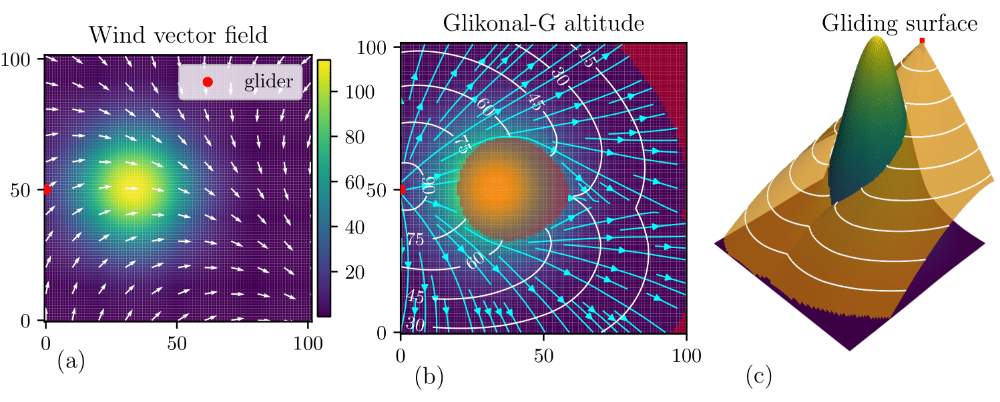
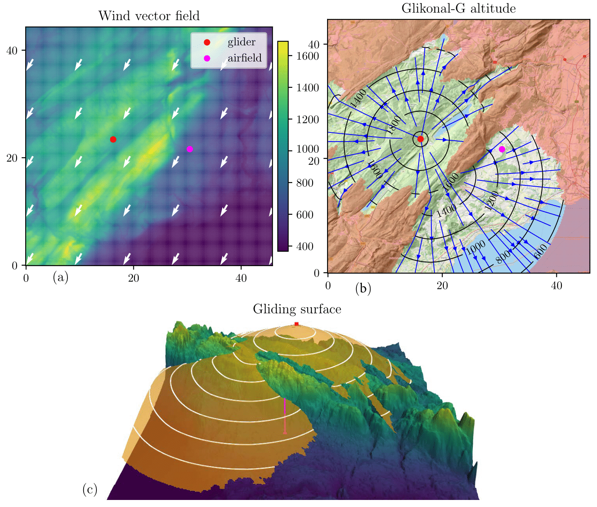
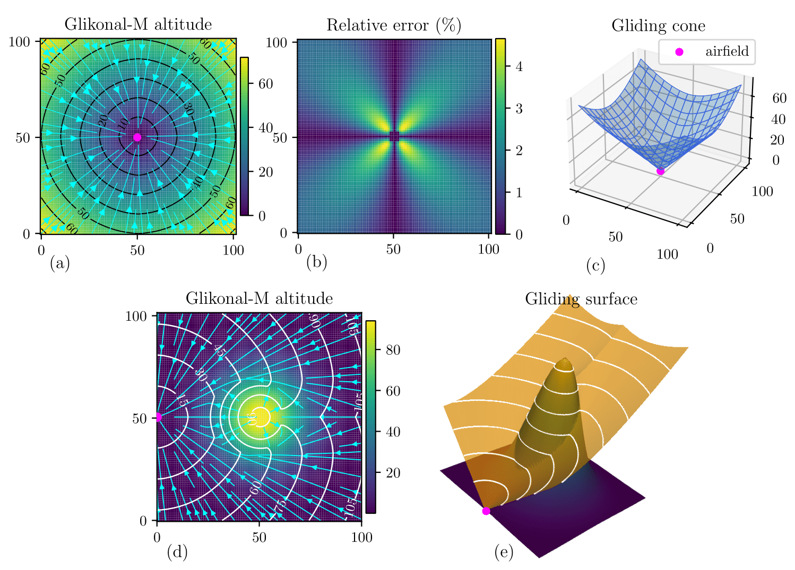
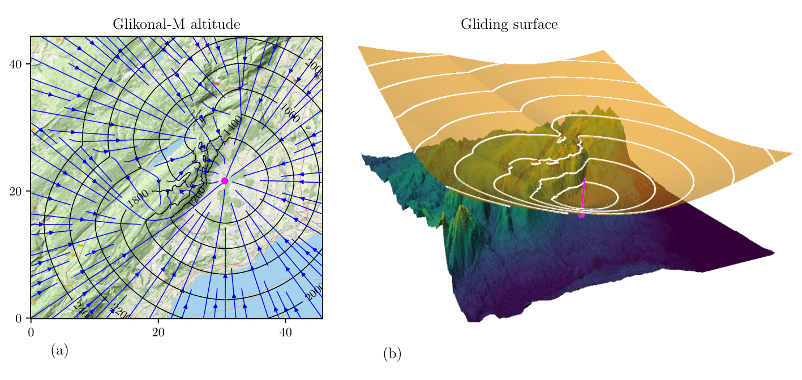

# This is the *Glikonal* repository
This repository contains the code and examples for the Glikonal-G and Glikonal-M algorithms introduced in the paper 'Computing an Aircraft's Gliding Range and Minimal Return Altitude in Presence of Obstacles and Wind' (https://arxiv.org/abs/2407.18056).
It also contains the code to reproduce the figures in the paper.

### Glikonal-G

Glikonal-G is an algorithm that solves the gliding reachable region problem (GRRP).
Given the initial position and altitude of an aircraft, GRRP consists of computing the region that can be safely reached in gliding flight by the aircraft, and the optimal paths to reach any point in the reachable region from the initial position. The paths are optimal in the sense that the altitude loss is minimal.  
Glikonal-G computes both the gliding reachable region and the optimal paths.
It also takes into account both ground obstacles (i.e., terrain) and wind. The code is based on a modified version of the Ordered Upwind Method (Sethian et al, Ordered upwind methods for static Hamilton-Jacobi equations: Theory and algorithms. 2003).

### Glikonal-M
Glikonal-M is an algorithm that solves the minimal return altitude problem (MRAP). 
Given the position of an airfield, MRAP consists of finding the minimal altitude an aircraft must have in order to reach the airfield in gliding flight, from any point in space. In addition we also want a gliding trajectory that brings the aircraft from its initial position to the airfield.
Glikonal-M solves MRAP while taking ground obstacles into account (but not wind). The algorithm is based on a variant of the Fast Marching Method (Sethian, A fast marching level set method for monotonically advancing fronts. 1996)

# Structure of the repository
## GRRP
The folder 'grrp' contains the files related to the Glikonal-G algorithm.
Inside the folder we find
1. 'glikonal_grrp.py' contains a python implementation of Glikonal-G.
2. The notebook 'paper_plots_grrp.ipynb' runs Glikonal-G on a series of artificial examples, to show its use and capabilities. It also reproduces the plots in the paper.
3. The notebook 'tests_glikonal_grrp.ipynb' contains some artificial instances in which GRRP can be solved analytically. The solution provided by Glikonal-G is compared with the analytical one.
4. The notebook 'real_data_glikonal_grrp_plots.ipynb' applies Glikonal-G to a real world setting. Elevation data from Switzerland is used to compute the gliding reachable region. It also generates the plots with real dta presented in the paper.
5. The folder 'grrp_cpp' contains a C++ implementation of Glikonal-G. This implementation is much faster than the python one. Inside the folder, the notebook 'run_cpp_glikonal_grrp.ipynb' runs the C++ code, while 'tests_glikonal_grrp_cpp.ipynb' contains the tests for the C++ implementation. The core of the algorithm is implemented in 'glikonal_grrp.cpp'
6. The folder 'pics' contains the pictures generated by the various notebooks.
## MRAP
The folder 'mrap' contains the files related to the Glikonal-M algorithm.
Inside the folder we find
1. 'glikonal_mrap.py' contains a python implementation of Glikonal-G.
2. The notebook 'paper_plots_mrap.ipynb' runs Glikonal-M on a series of artificial examples, to show its use and capabilities. It also reproduces the plots in the paper.
3. The notebook 'tests_glikonal_mrap.ipynb' contains some artificial instances in which MRAP can be solved analytically. The solution provided by Glikonal-M is compared with the analytical one.
4. The notebook 'real_data_glikonal_mrap_plots.ipynb' applies Glikonal-M to a real world setting. Elevation data from Switzerland is used to compute the gliding reachable region. It also generates the plots with real dta presented in the paper.
6. The folder 'pics' contains the pictures generated by the various notebooks.
# Examples
We now give an example of the results one can obtain using Glikonal-G and Glikonal-M

## Examples Glikonal-G
To better understand how the algorithm works one can start from artificial examples. In the notebook "paper_plots_grrp.ipynb", we look at the case of flat terrain, a single mountain peak and a mountain range with two saddles.

This notebook goes though these various examples of elevation profile, to show how Glikonal computes the gliding reachable region and the optimal paths.

Let us provide some pictures of this below.
### Single peak
For an elevation profile with a single peak, and glide ratio of 1 in absence of wind, we can plot the altitude of the glider throughout space. The initial altitude of the glider is 100. We also consider a varying wind vector field. The wind vector field and the elevation profile are plotted in panel (a). In panel (b) The contour lines of the glider's altitude are plotted together with the optimal trajectories (in turquoise). The red shaded region is unreachable in gliding flight.
The altitude of the glider is plotted in 3d in panel (c) in orange.

### Real data
We can also run the algorithm on real data. We use elevation data from Switzerland to study the gliding reachable region in practice. Panel (a) shows the elevation profile as a heatmap and the wind vector field with white arrows. In addition to the glider (red dot) the position of the closest airfeld is also indicated (purple dot). The glide ratio in absence of wnd is 20 and the initial altitude is 2070 m amsl. We require that at any point in the trajectory, the glider's height is at least 200 m above ground level. In (b) the contour lines of the altitude are plotted in black and the optimal trajectories in blue. The complement of the red shaded region is the region that can be reached in gliding flight. The 3d representation of the gliding surface in orange on top of the elevation profile (the vertical dimension is exagerated for visualization purposes).
 

## Examples Glikonal-M

### Flat terrain and single peak
The top row of the plot below considers the case fo flat terrain, while the bottom row illustrates the results of Glikonal-G in the case of an elevation profile with a single peak. In all cases the purple dot represents the position of the airfield, and the glide ratio is one.
In (a) the minimal altitude to return to the airfield is shown, through its contour lines and heatmap. In absence of wind and obstacles the re-entry trajectories are just straight lines. 
In the case of flat terrain we can compute the true minimal altitude analytically; we shall call $V:\mathbb R^2\mapsto \mathbb R$ the analytical solution and $V_G:\mathbb R^2\mapsto \mathbb R$ the algorithmic one. We then compute the error of the algorithmic solution $(V_G-V)/V$ and plot it in (b). A 3d plot of $V_G$ is presented in (c). The solution in this case is simply a cone. 
 
In the second example (bottom row), the elevation profile's heatmap is given in panel (d). The elevation profile has a single peak in the middle of the domain. In (b) the contour lines of the minimal altitude function are plotted, together with the re-entry trajectories (in truquoise). Panel (e) offers a 3d representation of both the minimal altitude function (in orange) and the elevation profile.
### Real data
We use the same topographic data from Switzerland and use Glikonal-G to compute the minimal altitude to return to Montricher's airfield (LSTR) in absence of wind. The glide ratio is 20, and we require the glider to always be 200 m above ground level. The elevation profile is the same as in the GRRP case. In (a) the contour lines of the minimal return altitude are plotted in black and the re-entry trajectories in blue. Pael (b) offers a 3d view of the minimal return altitude (in orange) and the elevation profile.
 

## How to cite
To cite this repository use 

 Piccioli, G. (2024). Computing an Aircraft's Gliding Range and Minimal Return Altitude in Presence of Obstacles and Wind. arXiv preprint arXiv:2407.18056 

## References
1. Piccioli, G. (2024). Computing an Aircraft's Gliding Range and Minimal Return Altitude in Presence of Obstacles and Wind. arXiv preprint arXiv:2407.18056 

2. Sethian, J. A. (1996). A fast marching level set method for monotonically advancing fronts. *Proceedings of the National Academy of Sciences, 93*(4), 1591–1595. https://doi.org/10.1073/pnas.93.4.1591
3. Sethian, J. A., & Vladimirsky, A. (2003). Ordered upwind methods for static Hamilton-Jacobi equations: Theory and algorithms. SIAM Journal on Numerical Analysis, 41(1), 325-363.

